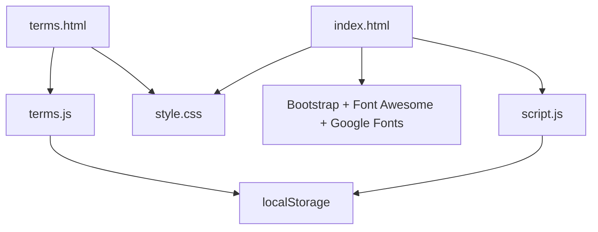

<div align="center">

# Vehicle Import Tax Calculator (Cambodia)

Unofficial bilingual web app (EN/KM) for estimating Cambodia vehicle import taxes.

[](index.html)
[](style.css)
[](script.js)
[](https://getbootstrap.com/)
[](index.html)

</div>

---

## Table of Contents

- [Overview](#overview)
- [Feature Matrix](#feature-matrix)
- [Architecture](#architecture)
- [Tax Logic](#tax-logic)
- [Run Locally](#run-locally)
- [Project Map](#project-map)
- [Security and Hardening](#security-and-hardening)
- [Release Checklist](#release-checklist)
- [Disclaimer](#disclaimer)

## Overview

> [!IMPORTANT]
> This is an unofficial community tool and not an official Cambodia Customs system.

This calculator is designed to help users estimate import taxes for vehicle categories using the 2026 rule set implemented in the project logic.

## Feature Matrix

| Area | What it includes |
|---|---|
| Tax engine | Cascading model: Customs Duty -> Special Tax -> VAT |
| Inputs | Vehicle type + CIF amount (USD) |
| Outputs | Full breakdown in USD and KHR |
| Rates table | Collapsible reference table for vehicle classes |
| Localization | English and Khmer UI switching |
| Themes | Dark and Light mode |
| Legal flow | Terms consent gate (agree required to use calculator) |
| Terms page | Dedicated terms page with persisted decision state |

## Architecture



## Tax Logic

### Calculation Pipeline

1. `CIF` (USD input)
2. `CD = CIF * CD%`
3. `ST Base = CIF + CD`
4. `ST = ST Base * ST%`
5. `VAT Base = CIF + CD + ST`
6. `VAT = VAT Base * VAT%`
7. `Total Tax = CD + ST + VAT`
8. `Total Landed Cost = CIF + Total Tax`

### Notes

> [!NOTE]
> Currency conversion shown in app uses `1 USD = 4,000 KHR`.

<details>
<summary><strong>Vehicle classes and rates currently encoded</strong></summary>

| Vehicle type | HS code | CD | ST | VAT |
|---|---|---:|---:|---:|
| Pure Electric Sedan | 8703.80 | 0% | 10% | 10% |
| Pure Electric SUV/Wagon/Other | 8703.80 | 0% | 10% | 10% |
| Electric Go-karts | 8703.80 | 35% | 10% | 10% |
| Electric ATVs | 8703.80 | 35% | 10% | 10% |
| Plug-in Hybrid Electric (PHEV) | 8703.60 | 7% | 10% | 10% |
| Electric Ambulance | 8703.80 | 0% | 0% | 10% |
| Electric Hearse | 8703.80 | 0% | 0% | 10% |
| Electric Prison Van | 8703.80 | 0% | 0% | 10% |
| Petrol/Diesel (Traditional ICE) | 8703.23/.33 | 35% | 35% | 10% |

</details>

## Run Locally

No build step is required.

```bash
# Option 1: double-click index.html
# Option 2: open the folder in VS Code and launch index.html in a browser
```

## Project Map

| File | Responsibility |
|---|---|
| [index.html](index.html) | Main calculator UI + modal shells |
| [script.js](script.js) | Calculator logic, i18n, theme, terms gating |
| [style.css](style.css) | All visual styling (glass UI, themes, responsive rules) |
| [terms.html](terms.html) | Terms content page |
| [terms.js](terms.js) | Terms page behavior + consent persistence |
| [.gitignore](.gitignore) | Git noise reduction |

## Security and Hardening

- CSP and Referrer-Policy meta headers configured in HTML pages.
- Sanitized terms return target (`from` query parameter) in terms flow.
- Defensive localStorage wrappers for restricted/private browser modes.
- `noopener noreferrer` on external links.
- Reduced-motion fallback for animation-sensitive users.

## Release Checklist

- [x] Main calculator translations (EN/KM)
- [x] Terms modal translations (EN/KM)
- [x] Terms gating and persisted consent
- [x] Dark/Light theme support
- [x] Security headers and link safety
- [x] Readme and repository hygiene

## Disclaimer

> [!WARNING]
> This app provides estimates only. Always confirm final amounts, procedures, and legal requirements with official Cambodia Customs channels before financial or import decisions.
